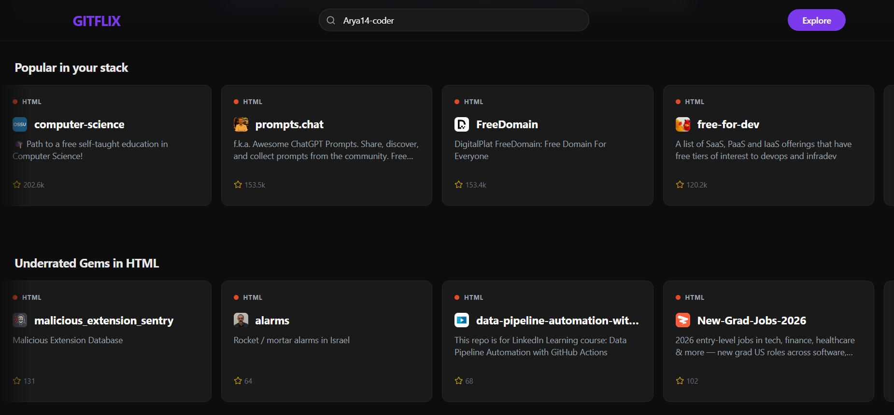

<div align="center">
  
  
  # 🍿 GitFlix
  
  **GitHub, but Netflix. Discover your next favorite repository with AI-powered recommendations.**

  [**Live Demo**](https://gitflix-blue.vercel.app/)
</div>


## ✨ What is GitFlix?

GitFlix transforms the way you discover open-source projects. Built for developers who want to find hidden gems, trending repositories, and projects perfectly tailored to their interests—all wrapped in an addictive, Netflix-style interface. 

Instead of infinitely scrolling GitHub's trending page, GitFlix uses your GitHub profile and OpenAI to curate personalized rows of repositories you're actually likely to star, contribute to, or use.

## 🚀 Features

- **🎬 Netflix-Style UI:** Beautiful, horizontally scrolling rows of repository recommendations.
- **🧠 AI-Powered Discovery:** Uses `openai` to analyze your starred repos and tech stack to find the best matches.
- **⚡ Upstash Redis Caching:** Caches GitHub API responses and AI embeddings to avoid rate limits and reduce recommendation latency.
- **📱 Responsive & Accessible:** Fully responsive design built with Tailwind CSS, working flawlessly from mobile to desktop.
- **🔍 Smart Fallbacks & Cold Starts:** If you haven't starred many repos, GitFlix seamlessly provides curated trending projects to get you started.

## 🛠️ Tech Stack

- **Framework:** [Next.js 16](https://nextjs.org/) (App Router)
- **Styling:** [Tailwind CSS](https://tailwindcss.com/)
- **Icons:** [Lucide React](https://lucide.dev/)
- **AI / Recommendations:** [OpenRouter](https://openrouter.ai/) (using OpenAI SDK)
- **Caching:** [Upstash Redis](https://upstash.com/)
- **Testing:** [Playwright](https://playwright.dev/)

## 🏁 Getting Started

### Prerequisites

- Node.js 18+ and npm / yarn / pnpm
- A GitHub Personal Access Token (for increased API limits)
- An OpenRouter API Key (provides access to OpenAI models)
- Upstash Redis credentials (for caching)

### Installation

1. Clone the repository:
   ```bash
   git clone https://github.com/Arya14-coder/gitflix.git
   cd gitflix
   ```

2. Install dependencies:
   ```bash
   npm install
   # or
   yarn install
   # or
   pnpm install
   ```

3. Set up environment variables:
   Create a `.env.local` file in the root directory and add the following:
   ```env
   # GitHub (Increase API rate limits)
   GITHUB_TOKEN=your_github_personal_access_token
   
   # OpenRouter (For AI recommendations)
   OPENROUTER_API_KEY=your_openrouter_api_key
   
   # Upstash Redis (For caching)
   UPSTASH_REDIS_REST_URL=your_upstash_redis_rest_url
   UPSTASH_REDIS_REST_TOKEN=your_upstash_redis_rest_token
   
   # App URL (For SEO metadata & absolute URLs)
   NEXT_PUBLIC_APP_URL=http://localhost:3000
   ```

4. Run the development server:
   ```bash
   npm run dev
   ```

5. Open [http://localhost:3000](http://localhost:3000) with your browser to see the result.

## 🧪 Testing

Run the Playwright end-to-end test suite:
```bash
npx playwright test
```

## 🤝 Contributing

Contributions are always welcome! Whether it's a bug report, feature suggestion, or a pull request.
1. Fork the Project
2. Create your Feature Branch (`git checkout -b feature/AmazingFeature`)
3. Commit your Changes (`git commit -m 'Add some AmazingFeature'`)
4. Push to the Branch (`git push origin feature/AmazingFeature`)
5. Open a Pull Request

## 🌐 Deployment

The easiest way to deploy your Next.js app is to use the [Vercel Platform](https://vercel.com/new).

Check out the [Next.js deployment documentation](https://nextjs.org/docs/app/building-your-application/deploying) for more details.
